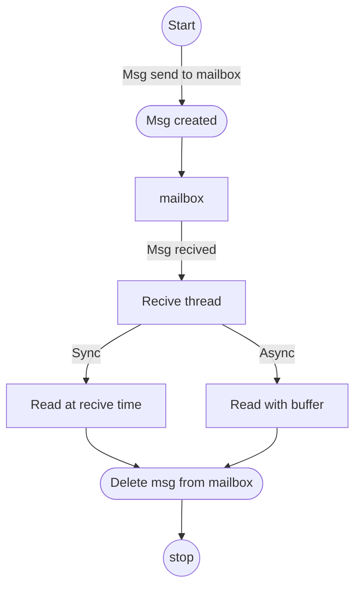

- [[#Message Format|Message Format]]
- [[#Message Lifecycle|Message Lifecycle]]
	- [[#Message Lifecycle#Synchronous send operation|Synchronous send operation]]
	- [[#Message Lifecycle#Asynchronous send operation|Asynchronous send operation]]
	- [[#Message Lifecycle#Retrieving Data at Receive Time|Retrieving Data at Receive Time]]
	- [[#Message Lifecycle#Retrieving Data Later Using a Message Buffer|Retrieving Data Later Using a Message Buffer]]
- [[#Thread Compatibility|Thread Compatibility]]
- [[#Message Descriptors|Message Descriptors]]
- [[Implementation of mailbox.canvas|Implementation of mailbox]]
- [[#Example|Example]]
- [[#Example#Reference|Reference]]

A _mailbox_ is a kernel object that allows threads to send and receive messages of any size synchronously or asynchronously. Each mailbox is referenced by its memory address.
A mailbox has the following key properties:
- A **send queue** of messages that have been sent but not yet received.
- A **receive queue** of threads that are waiting to receive a message.

> [!note]
> - A mailbox must be initialized before it can be used
> - A mailbox allows threads, but not ISRs, to exchange messages
> - Each message may be received by only one thread (i.e. **point-to-multipoint and broadcast messaging is not supported**).
> - Messages exchanged using a mailbox are handled non-anonymously

#### Message Format
- A [[#Message Descriptors]] is a data structure that specifies where a message’s data is located, and how the message is to be handled by the mailbox. 
- Both the sending thread and the receiving thread supply a message descriptor when accessing a mailbox. 
- A mailbox message contains zero or more bytes of **message data**. The size and format of the message data can vary from one message to the next.
- A message that has neither form of message data is called an **empty message**.
> [!Note]
> A message whose message buffer exists, but contains zero bytes of actual data, is _not_ an empty message.

#### Message Lifecycle
**Sending thread decide [[#Synchronous send operation|Sync]] (implicit form of flow control) or [[#Asynchronous send operation|Async communication]] (implicit form of flow control)**

- The message is immediately given to a compatible receiving thread, if one is currently waiting. Otherwise, the message is added to the mailbox’s send queue.
- Any number of messages may exist simultaneously on a send queue.
- The messages in the send queue are sorted according to the priority of the sending thread.
- Messages of equal priority are sorted so that the oldest message can be received first.

##### Synchronous send operation
- The operation normally completes when a receiving thread has both received the message and retrieved the message data.
- If the message is not received before the waiting period specified by the sending thread is reached, the message is removed from the mailbox’s send queue and the send operation fails.
- When a send operation completes successfully the sending thread can examine the message descriptor to determine which thread received the message, how much data was exchanged, and the application-defined info value supplied by the receiving thread.
- [int k_mbox_put(struct k_mbox* mbox, struct k_mbox_msg* tx_msg, k_timeout_t timeout)](https://docs.nordicsemi.com/bundle/ncs-latest/page/zephyr/kernel/services/data_passing/mailboxes.html#c.k_mbox_put). api is used for sync transmission
>[!Note]
>A synchronous send operation may block the sending thread indefinitely, even when the thread specifies a maximum waiting period. 
>The waiting period only limits how long the mailbox waits before the message is received by another thread. Once a message is received **there is _no_ limit to the time** the **receiving thread** may take **to retrieve the message data** and unblock the sending thread.
##### Asynchronous send operation
- The operation always completes immediately.
- This allows the sending thread to continue processing regardless of whether the message is given to a receiving thread immediately or added to the send queue.
- The use of a semaphore allows the sending thread to easily implement a flow control mechanism that ensures that the mailbox holds no more than an application-specified number of messages from a sending thread (or set of sending threads) at any point in time.
- [void k_mbox_async_put(struct k_mbox* mbox, struct k_mbox_msg* tx_msg, struct k_sem* sem)](https://docs.nordicsemi.com/bundle/ncs-latest/page/zephyr/kernel/services/data_passing/mailboxes.html#c.k_mbox_async_put "Permalink to this definition") api is used for aync transmission.
> [!note]
> A thread that sends a message asynchronously has no way to determine which thread received the message, how much data was exchanged, or the application-defined info value supplied by the receiving thread.

##### Retrieving Data at Receive Time
- The most straightforward way for a thread to retrieve message data is to specify a message buffer when the message is received.
  ``int k_mbox_get(struct k_mbox *mbox, struct k_mbox_msg *rx_msg, void *buffer, k_timeout_t timeout)``
- If the message buffer is not big enough to contain all of the message’s data, any uncopied data is lost.
- In all cases the mailbox updates the receiving thread’s message descriptor to indicate how many data bytes were copied (if any)
- The immediate data retrieval technique is best suited for small messages where the maximum size of a message is known in advance.

##### Retrieving Data Later Using a Message Buffer
- A receiving thread may choose to defer message data retrieval at the time the message is received, so that it can retrieve the data into a message buffer at a later time.
- The thread does this by specifying a message buffer location of `NULL` and a size indicating the maximum amount of data it is willing to retrieve later.
- The mailbox still updates the receiving thread’s message descriptor to indicate how many data bytes are available for retrieval.
- The subsequent data retrieval technique is suitable for applications where immediate retrieval of message data is undesirable.

#### Thread Compatibility
A sending thread can specify the address of the thread to which the message is sent. Likewise, a receiving thread can specify the address of the thread from which it wishes to receive a message.
A message is exchanged only when the requirements of both the sending thread and receiving thread are satisfied; such threads are said to be **compatible**.

> [!Example]
> Thread **A** sends a message to thread **B** (and only thread **B**) 
> - if thread **B** tries to receive a message from thread **A** ✅
> - if thread **B** tries to receive from any thread ✅
> - if thread **B** tries to receive a message from thread **C** ❌
> - If thread **C** tries to receive from thread **A** or any thread ❌

#### Message Descriptors
A message descriptor is a structure of type [`k_mbox_msg`](https://docs.nordicsemi.com/bundle/ncs-latest/page/zephyr/kernel/services/data_passing/mailboxes.html#c.k_mbox_msg "k_mbox_msg"). Only the fields listed below should be used;
- **_info_**: A 32-bit value that is exchanged by the message sender and receiver, and whose meaning is defined by the application
- **_size_**: The message data size, in bytes. Set it to zero when sending an empty message
- **_tx_data_**: A pointer to the sending thread’s message buffer
	- Set it to `NULL` when sending an empty message
	- Leave this field uninitialized when receiving a message
- **_tx_target_thread_**: The address of the desired receiving thread
	- Set it to `K_ANY` to allow any thread to receive the message
	- Leave this field uninitialized when receiving a message
- **_rx_source_thread_**: The address of the desired sending thread
	- Set it to `K_ANY` to receive a message sent by any thread
	- Leave this field uninitialized when sending a message

#### Example
1. Sync communication with empty msg and read on receive.
```c
#include <stdint.h>
#include <stdio.h>
#include <zephyr/kernel.h>
#include <zephyr/logging/log.h>
#include <zephyr/random/random.h>

/* 2200 msec = 2.2 sec */
#define PRODUCER_SLEEP_TIME_MS 2200

LOG_MODULE_REGISTER(mailbox_demo, LOG_LEVEL_DBG);

/* Stack size for both the producer and consumer threads */
#define STACKSIZE 512
#define PRODUCER_THREAD_PRIORITY 6
#define CONSUMER_THREAD_PRIORITY 7
#define DATA_SIZE 0
#define RECEIVED_ACK 2

/* Define the mailbox */
K_MBOX_DEFINE(my_mailbox);

static void producer_func(void* unused1, void* unused2, void* unused3)
{
    ARG_UNUSED(unused1);
    ARG_UNUSED(unused2);
    ARG_UNUSED(unused3);
    struct k_mbox_msg send_msg;

    while (1) {
        /* generate random value to send */
        uint32_t random_value = sys_rand32_get();

        /* prepare to send empty message */
        send_msg.info = random_value;
        send_msg.size = DATA_SIZE;
        send_msg.tx_data = NULL;
        send_msg.tx_target_thread = K_ANY;

        /* send message and wait until a consumer receives it */
        k_mbox_put(&my_mailbox, &send_msg, K_FOREVER);
        if (send_msg.info != RECEIVED_ACK) {
            LOG_ERR("Msg is not sent!");
        }
        else {
            LOG_INF("Thread 1: msg sent! \n received info : %d", send_msg.info);
        }
        k_msleep(PRODUCER_SLEEP_TIME_MS);
    }
}

static void consumer_func(void* unused1, void* unused2, void* unused3)
{
    ARG_UNUSED(unused1);
    ARG_UNUSED(unused2);
    ARG_UNUSED(unused3);

    struct k_mbox_msg recv_msg;
    char buffer[100];

    while (1) {
        // prepare to receive message
        recv_msg.info = RECEIVED_ACK;
        recv_msg.size = DATA_SIZE;
        recv_msg.rx_source_thread = K_ANY;

        // get a data item, waiting as long as needed
        k_mbox_get(&my_mailbox, &recv_msg, buffer, K_FOREVER);

        // info, size, and rx_source_thread fields have been updated
        LOG_INF("Thread 2: msg received with info %d", recv_msg.info);
        k_msleep(PRODUCER_SLEEP_TIME_MS);
    }
}

K_THREAD_DEFINE(producer, STACKSIZE, producer_func, NULL, NULL, NULL, PRODUCER_THREAD_PRIORITY, 0, 0);

K_THREAD_DEFINE(consumer, STACKSIZE, consumer_func, NULL, NULL, NULL, CONSUMER_THREAD_PRIORITY, 0, 0);
```

2. Sync communication with randomly generated msg data. Producer is deliberately sending the data only to consumer2 so consumer1 can never receive the msg.
```c
#include <stdint.h>
#include <stdio.h>
#include <zephyr/kernel.h>
#include <zephyr/logging/log.h>
#include <zephyr/random/random.h>

/* 2200 msec = 2.2 sec */
#define PRODUCER_SLEEP_TIME_MS 2200

LOG_MODULE_REGISTER(mailbox_demo, LOG_LEVEL_DBG);

/* Stack size for both the producer and consumer threads */
#define STACKSIZE 512
#define PRODUCER_THREAD_PRIORITY 6
#define CONSUMER_THREAD_PRIORITY 7
#define DATA_SIZE 10

extern const k_tid_t consumer2;

/* Define the mailbox */
K_MBOX_DEFINE(my_mailbox);
  
static void producer_func(void* unused1, void* unused2, void* unused3)
{
    ARG_UNUSED(unused1);
    ARG_UNUSED(unused2);
    ARG_UNUSED(unused3);
    struct k_mbox_msg send_msg;

    char buffer[20];

    while (1) {
        /* generate random value to send */
        sys_rand_get(&buffer, DATA_SIZE);

        /* prepare to send empty message */
        send_msg.info = DATA_SIZE;
        send_msg.size = DATA_SIZE;
        send_msg.tx_data = buffer;
        send_msg.tx_target_thread = consumer2;

        /* send message and wait until a consumer receives it */
        k_mbox_put(&my_mailbox, &send_msg, K_FOREVER);
        if (send_msg.info != DATA_SIZE) {
            LOG_ERR("Msg is not sent!");
        }
        else {
            LOG_INF("Producer: msg sent! \t received info : %d", send_msg.info);
        }
        k_msleep(PRODUCER_SLEEP_TIME_MS);
    }
}
  
static void consumer_func(int thread_id, void* unused2, void* unused3)
{
    ARG_UNUSED(unused2);
    ARG_UNUSED(unused3);
    struct k_mbox_msg recv_msg;
    char buffer[20];
  
    while (1) {
        // prepare to receive message
        recv_msg.info = DATA_SIZE;
        recv_msg.size = DATA_SIZE;
        recv_msg.rx_source_thread = K_ANY;
  
        // get a data item, waiting as long as needed
        k_mbox_get(&my_mailbox, &recv_msg, buffer, K_FOREVER);  

        // info, size, and rx_source_thread fields have been updated

        /* verify that message data was fully received */
        if (recv_msg.info != recv_msg.size) {
            LOG_ERR("some message data dropped during transfer!");
            LOG_INF("sender tried to send %d bytes", recv_msg.info);
        }
        else {
            LOG_INF("Thread %d: msg received with info %d", thread_id, recv_msg.info);
            LOG_HEXDUMP_INF(buffer, recv_msg.size, "Data:");
        }

        k_msleep(PRODUCER_SLEEP_TIME_MS);
    }
}

K_THREAD_DEFINE(producer, STACKSIZE, producer_func, NULL, NULL, NULL, PRODUCER_THREAD_PRIORITY, 0, 0);

K_THREAD_DEFINE(consumer1, STACKSIZE, consumer_func, 1, NULL, NULL, CONSUMER_THREAD_PRIORITY, 0, 0);
K_THREAD_DEFINE(consumer2, STACKSIZE, consumer_func, 2, NULL, NULL, CONSUMER_THREAD_PRIORITY, 0, 0);
```

3. Following is an example of Async communication for mailbox. Here each thread has its own wait which are not in sync. However there is no mechanism to restrict producer from flooding mailbox in this exapmle this can be done with use of [[Semaphores]].
```c
#include <stdint.h>
#include <stdio.h>
#include <zephyr/kernel.h>
#include <zephyr/logging/log.h>
#include <zephyr/random/random.h>

/* 2200 msec = 2.2 sec */
#define PRODUCER_SLEEP_TIME_MS 2200

LOG_MODULE_REGISTER(mailbox_demo, LOG_LEVEL_DBG);
/* Stack size for both the producer and consumer threads */
#define STACKSIZE 512
#define PRODUCER_THREAD_PRIORITY 6
#define CONSUMER_THREAD_PRIORITY 7
#define DATA_SIZE 10

/* Define the mailbox */
K_MBOX_DEFINE(my_mailbox);

static void producer_func(void* unused1, void* unused2, void* unused3)
{
    ARG_UNUSED(unused1);
    ARG_UNUSED(unused2);
    ARG_UNUSED(unused3);
    struct k_mbox_msg send_msg;

    uint32_t index = 0;
    char buffer[20];

    while (1) {
        /* generate random value to send */
        sys_rand_get(&buffer, DATA_SIZE);

        /* prepare to send empty message */
        send_msg.info = index;
        send_msg.size = DATA_SIZE;
        send_msg.tx_data = buffer;
        send_msg.tx_target_thread = K_ANY;

        /* send message async */
        k_mbox_async_put(&my_mailbox, &send_msg, NULL);
  
        LOG_INF("Producer: msg sent!");

        k_msleep(1000);
        index++;
    }
}

static void consumer_func(int thread_id, void* unused2, void* unused3)
{
    ARG_UNUSED(unused2);
    ARG_UNUSED(unused3);
    struct k_mbox_msg recv_msg;
    char buffer[50];
  
    while (1) {
        // prepare to receive message
        recv_msg.size = DATA_SIZE;
        recv_msg.rx_source_thread = K_ANY;

        // get message, but not its data
        k_mbox_get(&my_mailbox, &recv_msg, NULL, K_FOREVER);

        // info, size, and rx_source_thread fields have been updated
        k_msleep(PRODUCER_SLEEP_TIME_MS); 

        // get message data for only certain types of messages
        if ((recv_msg.info % 2) == 0) {
            // retrieve message data and delete the message
            k_mbox_data_get(&recv_msg, buffer);
            LOG_HEXDUMP_INF(buffer, recv_msg.size, "Data:");
        }
        else {
            // ignore message data and delete the message
            k_mbox_data_get(&recv_msg, NULL);
            LOG_INF("Msg ignored!");
        }
    }
}

K_THREAD_DEFINE(producer, STACKSIZE, producer_func, NULL, NULL, NULL, PRODUCER_THREAD_PRIORITY, 0, 0);

K_THREAD_DEFINE(consumer, STACKSIZE, consumer_func, 1, NULL, NULL, CONSUMER_THREAD_PRIORITY, 0, 0);
```


##### Reference
- https://docs.nordicsemi.com/bundle/ncs-latest/page/zephyr/kernel/services/data_passing/mailboxes.html#receiving_a_message