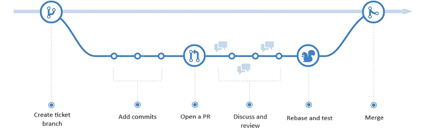

- [[#Introduction|Introduction]]
- [[#Project workflow|Project workflow]]
- [[#Setup for documentation|Setup for documentation]]
- [[#Guidelines for task management|Guidelines for task management]]
			- [[#1. Epics|1. Epics]]
			- [[#2. Tasks|2. Tasks]]
- [Notes](Notes)
- [[#References|References]]

### Introduction
Obsidian is a wiki software which has markdown as a backend. It supports long list of plugins which can add different features. However in this project only following plugin is essential.
- [Projects](https://github.com/marcusolsson/obsidian-projects)
- [Git](https://github.com/denolehov/obsidian-git)
- [Table of content](https://github.com/hipstersmoothie/obsidian-plugin-toc)
- [Mermaid](https://github.com/dartungar/obsidian-mermaid)

> [!Note]
> Please don't push another plugin or change any settings without discussion with all collaborators

### Project workflow

- Use task ID while creating branches in git and also in PR title so that traceability can be maintained
- Create Draft PR as soon as work on the ticket is started and put the link of same in ticket properties
- Prefer to use signed commit's, however this is optional

### Setup for documentation
1. Install Obsidian software
2. Select option to open existing vault and navigate to ``/doc/nrf_tasks/`` folder
3. Once vault is open and if settings are not synced automatically then continue following steps other wise jump to step 8.
4. Disable restricted mode and open browse to install plugins
5. Install and enable ``projects`` plugin
6. In core plugin template select ``_tempate`` folder as source
7. Configure ``_assets`` as default folder for images
8. Open projects view and select ``tasks`` as the project folder.

### Guidelines for task management
###### 1. Epics
- Use epics to group tasks into features
- ***NRF-E*** should be used as prefix for epic ID
- Every epic should have epic is at the start of the title.

###### 2. Tasks
- Always use projects view to create new tasks so that all settings will be correct.
- ***NRF-*** should be used along with incremental number as task ID in title of task
- Change assignee in the ticket with your name use links so that if required all tasks assigned to some user can be checked at once i.e, \[\[\<your name\>\]\]
- Provide appropriate tags if required
- Once PR is merged change the status and put completed date in properties of the ticket.

> [!Note]
> Use one of following as status for the ticket 
> 1. **Backlog** : Should be default status till someone start working on it
> 2. **InProgress** : As soon as work is started
> 3. **InReview** : Once PR is created and rework is in progress
> 4. **Done** : Once PR is merged

### References

- [[Notes#^275f75|Reference Videos]]
- [nRF connect doc link](https://docs.nordicsemi.com/bundle/ncs-latest/page/nrf/installation/install_ncs.html)