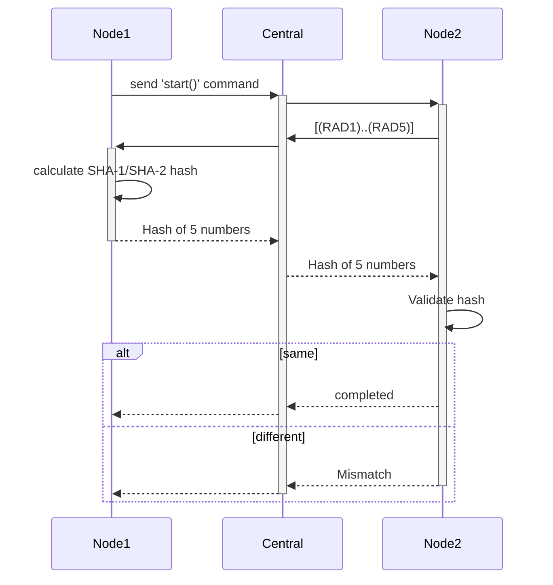

#### Description
Integrate points learned in 2 simple codes and create new sample.
Things to learn:
- Random number generation using crypto cell
- SHA-1/SHA-2 hashing using crypto cell
#### Sub-Task
- [ ] Use applications created in [NRF-3] and [NRF-4] to create a communication bridge
- [ ] Central should do following tasks
	- [ ] Maintain connection of 2 nodes and assign them node_id
	- [ ] Relay data received from 1 node to other if node_id matches 
- [ ] Each node should do following tasks
	- [ ] Connect with central and maintain connection on 1 thread
	- [ ] In second thread monitor SW1. If SW1 is pressed then start following sequence.

- [ ] (Optional) Add support for nRF52 board

#### Task Relationships
- Depends on: 
	- [[[NRF-3] Create first application]]
	- [[[NRF-4] Update UART central to connect with 2 nodes]]