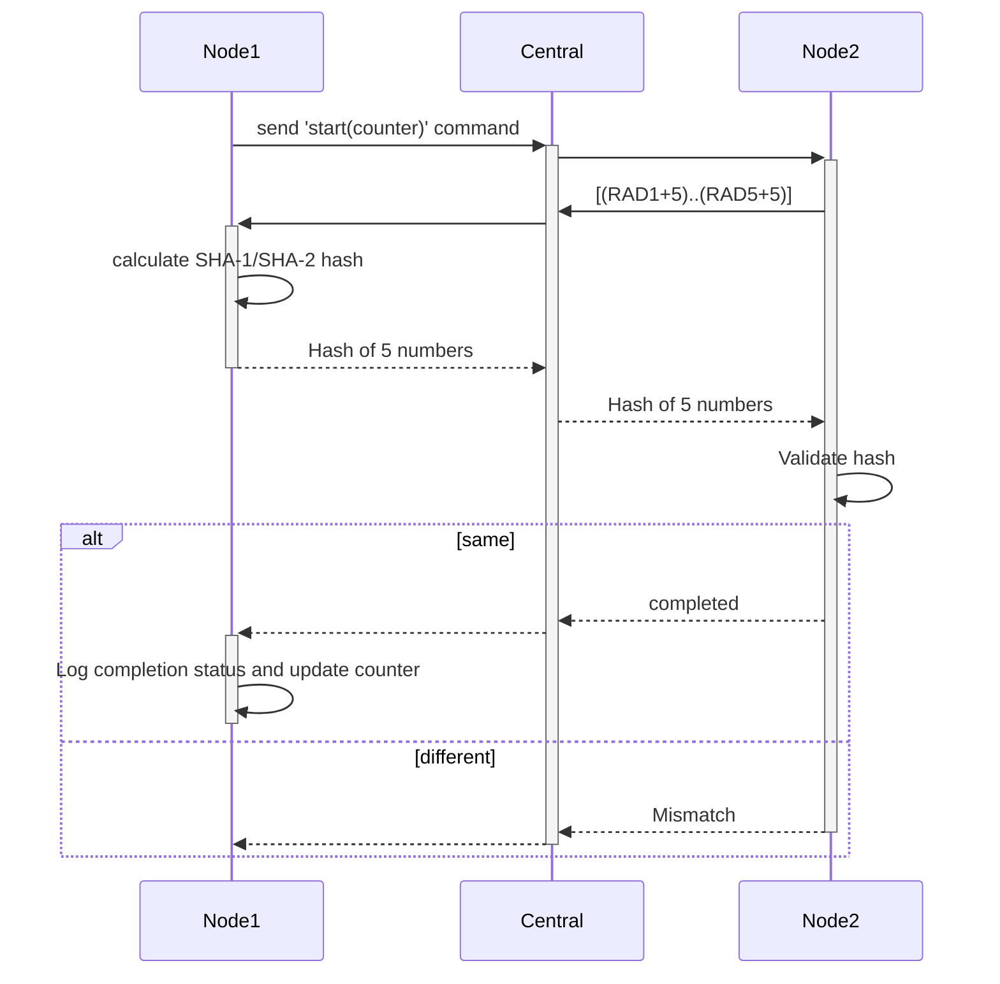

#### Description
nRF supports OTA and there is separate process to build and deploy the OTA updates.
Things to learn:
- MCUBoot (introduction)
- OTA build and update
#### Sub-Task
- [ ] Use node application used in [[[NRF-5] 1C - 2P Communication bridge|NRF-5]] and make it OTA compliant
- [ ] Update application to comply with following sequence

#### Task Relationships
- Depends on:
	- [[[NRF-5] 1C - 2P Communication bridge]]